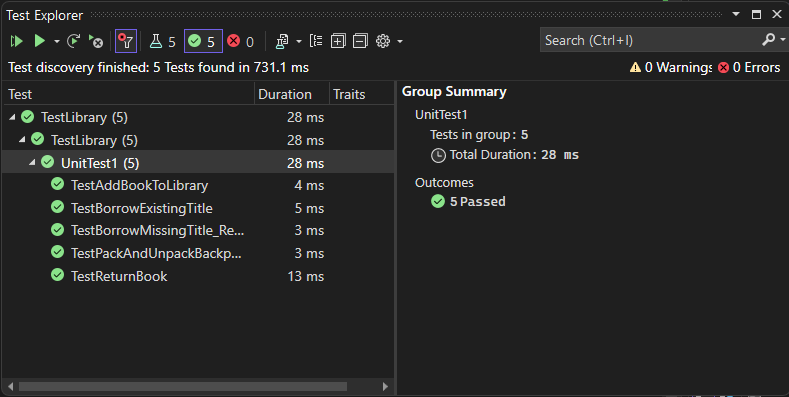

# Phil's-Lending-Library

## Overview

The Lending Library provides functionality for managing a library of books and a backpack for borrowing and storing books.

The solution consists of the following:
- `Book`: A class representing a book with properties such as title, author, and number of pages.
- `Library`: A class implementing the `ILibrary` interface that manages a collection of books. It provides methods for adding, borrowing , returning , and iterating over the books in the library.
- `Backpack<T>`: A generic class implementing the `IBag<T>` interface that represents a backpack capable of storing items of any type. It provides methods for packing items into the backpack and unpacking items from it.

## unit testing 

the unit test code was written to test thes cases:

1. Add a Book to your Library
2. Borrowing an existing title returns the Book and remove it
3. Borrowing a missing title returns null
4. A returned book is once again in the Library
5. Pack and Unpack your Backpack

